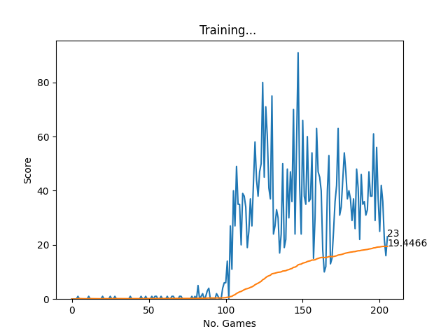

# Deep Q-Learning for Snake Game

This repository contains a Deep Q-Learning agent that learns how to play the classic Snake game. The project involves training an agent using reinforcement learning to maximize its score by optimizing the game's strategy.

## Table of Contents

- [Project Overview](#project-overview)
- [Demo](#demo)
- [Results](#results)
- [Features](#features)
- [Installation](#installation)
- [Usage](#usage)
- [References](#references)
- [License](#license)

## Demo

Here’s a preview of the agent playing the Snake game:


## Results

After training the model over 200 games, the following results were obtained:



The chart above shows the agent's score over time, along with the average score per game.

## Project Overview

The goal of this project is to apply deep reinforcement learning to teach an agent to play Snake. The agent is trained using a deep Q-network (DQN) that learns to optimize game performance over time by balancing exploration and exploitation.

### Key Concepts:
- **Deep Q-Learning**: The model uses a neural network to approximate Q-values for each action and update them based on rewards.
- **Exploration vs. Exploitation**: The agent explores different strategies during training while gradually exploiting known strategies that yield better results.
- **Reward Structure**: The reward function encourages the agent to eat food while penalizing collisions with walls or itself.

## Features

- Configurable environment for training the agent.
- Dynamic adjustment of reward values and gamma (discount factor) for better learning.
- Visualization of the training process and game performance.
- Ability to save and load trained models for later use.

## Installation

1. Clone this repository:

```bash
git clone https://github.com/yourusername/snake-dqn.git
cd snake-dqn
```

2. Install the required dependencies:

```bash
pip install -r requirements.txt
```

## Usage

To train the agent:

```bash
python train.py
```

To watch the trained agent play the game:

```bash
python play.py
```

You can modify hyperparameters such as the number of episodes, gamma, and learning rate in the `config.py` file.


## References

- [Deep Q-Learning Algorithm](https://www.nature.com/articles/nature14236)
- [Pygame Documentation](https://www.pygame.org/docs/)

## License

This project is licensed under the MIT License. See the [LICENSE](LICENSE) file for details.

---

Bạn có thể tùy chỉnh thêm các thông tin như đường dẫn đến các hình ảnh hoặc video demo, cũng như thêm chi tiết cụ thể hơn cho dự án của mình.
